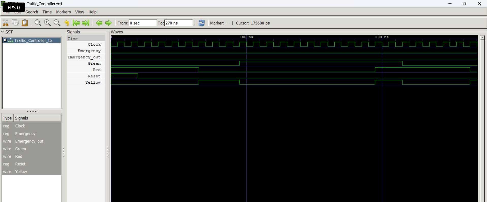
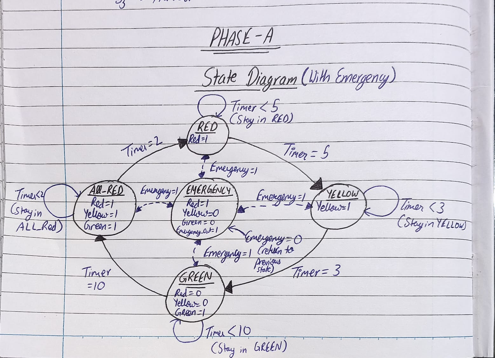

# FSM-Based Smart Traffic Light Controller with Emergency Override

> **Tools:** Icarus Verilog · GTKWave · VS Code  
> **Language:** Verilog HDL  
> **Status:** ✅ Phase A Complete — Basic Controller Done

---

## Research Question

> *How does the choice of FSM design and state encoding affect system 
> responsiveness and hardware behaviour when priority conditions are 
> introduced into a real-time digital controller?*

This project investigates that question by building a traffic light 
controller in two phases — first without emergency override, then with 
it — and comparing the design decisions, state complexity, and 
behavioural differences between both versions.

---

## Why This Project

A traffic light controller is one of the simplest real-world FSM 
applications. But adding an emergency vehicle override turns it into 
a genuinely interesting design problem — the FSM must handle a 
priority condition that can interrupt normal operation at any state 
and recover cleanly when the condition clears.

This project was built to understand how that priority logic changes 
FSM design at the RTL level — not just to make a traffic light work.

---

## Project Structure

smart-traffic-controller/
src/
traffic_basic.v — Phase A: basic FSM
traffic_emergency.v — Phase B: FSM with emergency override
traffic_top.v — Phase B: top module
testbenches/
tb_traffic_basic.v — Phase A testbench
tb_traffic_emergency.v — Phase B testbench
docs/
state_diagram_basic.png — Phase A state diagram
state_diagram_emergency.png — Phase B state diagram
waveform_basic.png — Phase A GTKWave output
waveform_emergency.png — Phase B GTKWave output
README.md
---

## Development Phases

### Phase A — Basic Traffic Controller
**Status:** 🔄 In Progress

A Moore FSM with 4 states controlling a 4-direction traffic light 
system. Clock-driven state transitions, synchronous reset, full 
testbench with all state transitions verified.

**States:** S0 → S1 → S2 → S3 → S0 (repeating cycle)  
**Goal:** Verify basic FSM structure and timing before adding complexity.

---

### Phase B — Emergency Vehicle Override
**Status:** ⬜ Not Started

Adds an emergency input that immediately forces the FSM into a 
dedicated EMERGENCY state regardless of current state. The system 
stores the previous state and recovers to it when emergency clears.

**New state:** EMERGENCY  
**New input:** Emergency signal (active HIGH)  
**Goal:** Understand how priority logic changes FSM design.

---

### Phase C — Comparison and Documentation
**Status:** ⬜ Not Started

Compares Phase A and Phase B designs across three dimensions:
- State count and complexity
- How priority input changed the state transition diagram
- Behavioural differences visible in GTKWave waveforms

Documents what was learned — including what didn't work and why.

**Goal:** Answer the research question with evidence from simulation.

---

## Module Structure

|            Module             |          File            | Phase |
|-------------------------------|--------------------------|-------|
| Basic Traffic Controller      | `traffic_basic.v`        |   A   |
| Emergency Override Controller | `traffic_emergency.v`    |   B   |
| Top Module                    | `traffic_top.v`          |   B   |
| Basic Testbench               | `tb_traffic_basic.v`     |   A   | 
| Emergency Testbench           | `tb_traffic_emergency.v` |   B   |

---

## Tools

| Tool           |           Purpose                 |
|----------------|-----------------------------------|
| Icarus Verilog | Compilation and simulation        |
| GTKWave        | Waveform viewing and verification |
| VS Code        |           Code editor             |
| GitHub         | Version control and documentation |
---
# Progress Report Day 1:
What was done today: Today , the state diagram was made firstly on paper for knowing the architecture
then State tables made for all the states there is table given below and state diagram drawn through blocks.
Made some descisions like what state will remain on till how much cylces and defining which traffic-light output 
is active in each state,also took descisons like when on emergency should it go to previous state or it should
go back to the very first beginning state.

Then made some progress with project starting with the file of main module where today made only the inputs and the parameters needed which are explained briefly below.

## State Diagram

                         Timer = 5 cycles
                    ┌──────────────────────┐
                    │                      ↓
                 ┌───────┐             ┌────────┐
          ┌──────│  RED  │────────────→│ YELLOW │
          │      └───────┘  Timer=5    └────────┘
          │                                  │
          │                              Timer=3
          │                                  ↓
          │                              ┌────────┐
          │                              │ GREEN  │
          │                              └────────┘
          │                                  │
          │                             Timer=10
          │                                  ↓
          │                            ┌──────────┐
          │                            │ ALL_RED  │
          │                            └──────────┘
          │                                  │
          │                              Timer=2
          └──────────────────────────────────┘
** For Emergency **
                 Emergency = 1
        ┌────────────────────────────────┐
        │                                ↓
      RED ─────────────────────────→ EMERGENCY
      YELLOW ──────────────────────→ EMERGENCY
      GREEN ───────────────────────→ EMERGENCY
      ALL_RED ─────────────────────→ EMERGENCY
                                      │
                              Emergency = 0
                                      ↓
                              Previous State
## State table

| Current State    | Emergency | Timer Condition | Next State     |
| ---------------- | --------: | --------------- | -------------- |
| RED              |         0 | Timer < 5       | RED            |
| RED              |         0 | Timer = 5       | YELLOW         |
| YELLOW           |         0 | Timer < 3       | YELLOW         |
| YELLOW           |         0 | Timer = 3       | GREEN          |
| GREEN            |         0 | Timer < 10      | GREEN          |
| GREEN            |         0 | Timer = 10      | ALL_RED        |
| ALL_RED          |         0 | Timer < 2       | ALL_RED        |
| ALL_RED          |         0 | Timer = 2       | RED            |
| Any normal state |     **1** | Don't care      | **EMERGENCY**  |
| EMERGENCY        |         1 | Don't care      | EMERGENCY      |
| EMERGENCY        |         0 | Don't care      | Previous State |

## ARCHITECTURE 

                 ┌──────────────────┐
                 │   State Register │
Clock ──────────→│                  │
Reset ──────────→│ current_state    │
                 └────────┬─────────┘
                          │
                          ↓
                 ┌──────────────────┐
                 │  Next-State      │
Emergency ──────→│     Logic        │
                 └────────┬─────────┘
                          │
                          ↓
                 ┌──────────────────┐
                 │ Timer / Counter  │
                 └────────┬─────────┘
                          │
                          ↓
                 ┌──────────────────┐
                 │ Output Logic     │
                 └──────────────────┘
                          │
             ┌────────────┴────────────┐
             ↓                         ↓
       Traffic Lights           Emergency_Out
---
### Day 1 Outcome

Architecture finalized → State behavior defined → Emergency strategy decided → Initial RTL structure created.

Next step: implement the state register and timer/counter logic.

**Day 1: Architecture ✅** 

---
### Day 7 Outcome

### Phase A — Basic Traffic Controller
**Status:** ✅ Complete

A Moore FSM with 5 states controlling a traffic light system.
Timer-based transitions — each state remains active for a 
configurable number of clock cycles before transitioning.

**States:**

| State     |         Output           |    Duration   |
|-----------|--------------------------|---------------|
| RED       |           Red=1          |    5 cycles   |
| YELLOW    |          Yellow=1        |     3 cycles  |
| GREEN     |           Green=1        |    10 cycles  |
| ALL_RED   | Red=1, Yellow=1, Green=1 |    2 cycles   |
| EMERGENCY | Red=1, Emergency_out=1   | Until cleared |

**Waveform:**

**State Diagram:**

**Key design decisions:**
- Timer implemented as a counter inside the state register block
- `state_duration` computed combinationally based on current state
- ALL_RED state added as a safety buffer between GREEN and RED
- EMERGENCY stores previous state for clean recovery

**Files:**
- `src/Traffic_Controller.v` — main FSM module
- `testbenches/Traffic_Controller_tb.v` — Phase A testbench

## Current Progress

- [x] Project structure created
- [x] Research question defined
- [x] Phase A — Basic FSM designed and simulated
- [x] Phase A — Timer-based transitions verified in GTKWave
- [x] Phase A — State diagram documented
- [ ] Phase B — Emergency override tested with dedicated testbench
- [ ] Phase B — Recovery behaviour verified
- [ ] Phase C — Comparison written
- [ ] Phase C — README complete with findings

---
### Phase B — Emergency Vehicle Override
**Status:** 🔄 In Progress
---

*This project is part of my preparation for VLSI research internship 
applications. The goal is not just a working simulation — it is 
understanding the design decisions behind it.*

