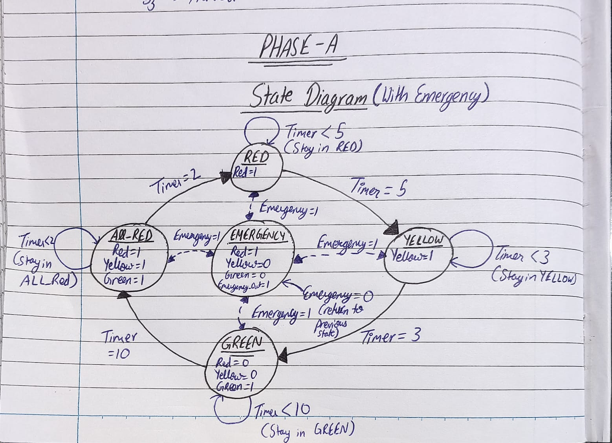
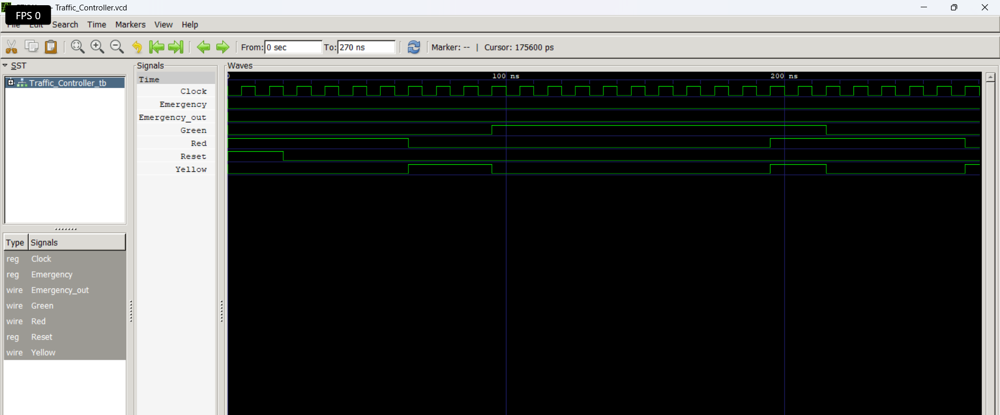
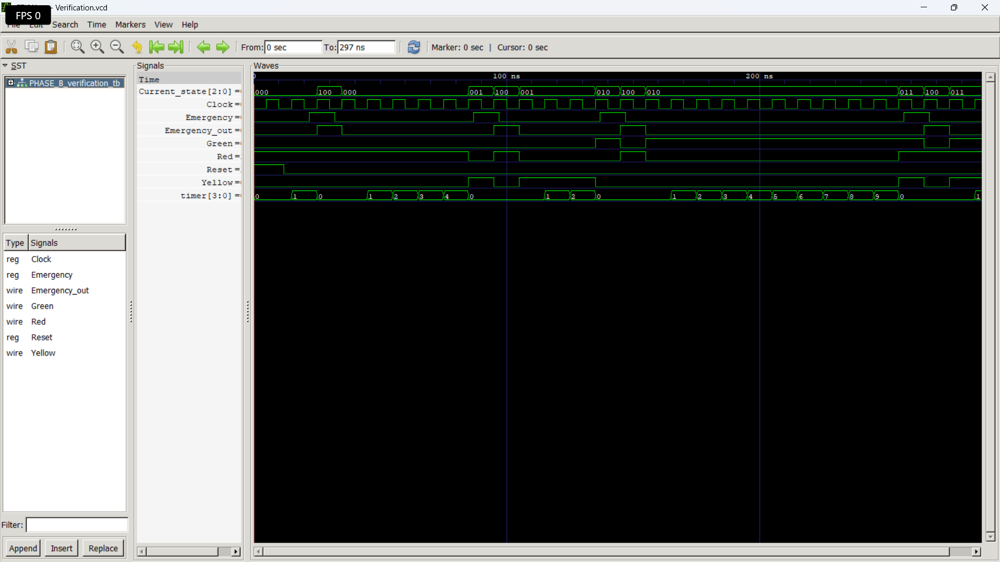

# FSM-Based Smart Traffic Light Controller with Emergency Override

> **Tools:** Icarus Verilog · GTKWave · VS Code 
> **Language:** Verilog HDL  
> **Author:** Yash Gupta | ECE 3rd Year 
> **Status:** ✅ Phase A Complete · ✅ Phase B Complete · ⬜ Phase C In Progress

---

## Research Question

> *How does implementing priority-based emergency override in an FSM-based 
> digital controller affect state complexity, hardware resource usage, and 
> system responsiveness compared to a basic sequential FSM design?*

This project investigates that question by designing a complete 5-state 
traffic light controller with emergency override built from the start, 
verifying it exhaustively through simulation, and analysing the hardware 
implications through Yosys synthesis in Phase C.

---

## Why This Project

A traffic light controller is one of the simplest real-world FSM 
applications. But adding emergency vehicle override turns it into a 
genuinely interesting design problem — the FSM must handle a priority 
condition that can interrupt normal operation at any state and recover 
cleanly when the condition clears.

This project was designed with the complete 5-state architecture from 
the start — including emergency handling — because the state diagram 
made clear that emergency logic cannot be retrofitted cleanly. It 
changes the fundamental FSM structure including state encoding, register 
width, and output logic.

The project investigates how that design choice affects hardware 
complexity and system behaviour through simulation and synthesis analysis.

---

## Project Structure

```
smart-traffic-controller/
  src/
    Traffic_Controller.v           — Complete 5-state FSM module
  testbenches/
    Traffic_Controller_tb.v        — Phase A: normal operation testbench
    PHASE_B_verification_tb.v      — Phase B: emergency scenario testbench
  docs/
    state_diagram_phase_a.jpeg     — Hand-drawn state diagram
  Waveforms/
    waveform_basic.png             — Phase A GTKWave output
    Verification_phase_b.png       — Phase B GTKWave output
  README.md
  DEVLOG.md
  .gitignore
```

---

## Development Phases

### Phase A — Complete FSM Design and Normal Operation Verification
**Status:** ✅ Complete

Designed and implemented a complete 5-state Moore FSM from the start.
Timer-based transitions, ALL_RED safety state, and emergency override
all included in the initial design based on the paper state diagram.

Phase A testbench verified normal operation — full cycle through
RED → YELLOW → GREEN → ALL_RED → RED with correct timer durations
confirmed in GTKWave.

**States:**

|    State  |          Output          |    Duration  |
|-----------|--------------------------|--------------|
|   RED     |          Red=1           |   5 cycles   |
| YELLOW    |         Yellow=1         | 3 cycles     |
| GREEN     |         Green=1          | 10 cycles    |
| ALL_RED   | Red=1, Yellow=1, Green=1 | 2 cycles     |
| EMERGENCY |  Red=1, Emergency_out=1  | Until cleared |

**State Diagram:**



**Phase A Waveform:**



**Key design decisions:**
- Timer implemented as a counter inside the state register block
- `state_duration` computed combinationally based on current state — separates timing from sequential logic
- ALL_RED state added as a safety buffer between GREEN and RED
- EMERGENCY state stores previous_state for clean recovery when emergency clears
- Emergency override designed into initial architecture — not retrofitted

**Files:**
- `src/Traffic_Controller.v` — main FSM module
- `testbenches/Traffic_Controller_tb.v` — Phase A testbench

---

### Phase B — Exhaustive Emergency Scenario Verification
**Status:** ✅ Complete

Dedicated verification testbench written specifically for emergency
scenarios. Phase A testbench only verified normal operation with
Emergency permanently LOW. Phase B fires Emergency during every
possible state and verifies correct recovery.

**Key testbench technique used:**
`wait` statements automatically detect when FSM reaches the target
state before firing Emergency — eliminates manual delay calculations
and makes the testbench independent of timer duration values.

```verilog
wait (DUT.Current_state == 3'b001); #2;
Emergency = 1'b1; #10;
Emergency = 1'b0; #10;
```

**Scenarios verified:**

| Scenario | Emergency Fired During | State Code | Recovery State | Result |
|----------|------------------------|------------|----------------|--------|
|    1     |          RED           |     000    |    RED (000)   |   ✅   |
|    2     |         YELLOW         |     001    |   YELLOW (001) |   ✅   |
|    3     |          GREEN         |     010    |   GREEN (010)  |   ✅   |
|    4     |         ALL_RED        |     011    |  ALL_RED (011) |   ✅   |

**Phase B Waveform:**



**Waveform confirms:**
- Current_state immediately jumps to 100 (EMERGENCY) on clock edge after Emergency goes HIGH
- Emergency_out goes HIGH and Red goes HIGH simultaneously during EMERGENCY state
- Timer resets to 0 on every emergency event and on every recovery
- FSM returns to exact previous state when Emergency clears in all 4 cases
- No stuck states or undefined behaviour observed

**Known limitation:**
When Emergency fires near the end of a state and clears, the FSM
returns to that state with timer reset to 0 — giving the state its
full duration again rather than the remaining cycles. A production
design would store remaining timer value alongside previous_state.
This is discussed further in Phase C.

**Files:**
- `testbenches/PHASE_B_verification_tb.v` — Phase B emergency testbench

---

### Phase C — Synthesis Analysis and Research Findings
**Status:** ⬜ Not Started

Yosys open-source synthesis tool will be run on the complete design
to extract gate count, flip-flop count, and generate a schematic.
Design decisions will be compared against published literature on
FSM-based traffic controllers. The research question will be answered
with evidence from synthesis data and simulation results.

**Planned deliverables:**
- Gate count and flip-flop report from Yosys
- Visual schematic of synthesised design
- Literature comparison table
- Research question answered with evidence

---

## Module Structure

|     Module         |              File                       |              Description                     |
|--------------------|-----------------------------------------|----------------------------------------------|
| Traffic Controller |       `src/Traffic_Controller.v`        | Complete 5-state FSM with emergency override |
| Phase A Testbench  |   `testbenches/Traffic_Controller_tb.v` |      Normal operation verification           |
| Phase B Testbench  | `testbenches/PHASE_B_verification_tb.v` |      Emergency scenario verification         |

---

## State Transition Table

| Current State | Emergency | Timer Condition | Next State |
|--------------|-----------|-----------------|------------|
| RED | 0 | Timer < 5 | RED |
| RED | 0 | Timer = 5 | YELLOW |
| YELLOW | 0 | Timer < 3 | YELLOW |
| YELLOW | 0 | Timer = 3 | GREEN |
| GREEN | 0 | Timer < 10 | GREEN |
| GREEN | 0 | Timer = 10 | ALL_RED |
| ALL_RED | 0 | Timer < 2 | ALL_RED |
| ALL_RED | 0 | Timer = 2 | RED |
| Any normal state | 1 | Don't care | EMERGENCY |
| EMERGENCY | 1 | Don't care | EMERGENCY |
| EMERGENCY | 0 | Don't care | Previous State |

---

## Tools

| Tool | Purpose |
|------|---------|
| Icarus Verilog | Compilation and functional simulation |
| GTKWave | Waveform viewing and timing verification |
| VS Code | Code editor with Verilog syntax support |
| Yosys | Open-source synthesis — gate count and schematic (Phase C) |
| GitHub | Version control and documentation |

---
---
### Phase C — Synthesis Analysis and Comparison
**Status:** 🔄 In Progress

**C1 — Basic Controller built and verified ✅**

A stripped-down 4-state Moore FSM with no emergency logic — built
specifically as a baseline for comparison against the Smart Controller.
Same timer durations, same state structure, no previous_state register,
no emergency input, no Emergency_out output.

**States:**

| State | Output | Duration |
|-------|--------|----------|
| RED | Red=1 | 5 cycles |
| YELLOW | Yellow=1 | 3 cycles |
| GREEN | Green=1 | 10 cycles |
| ALL_RED | Red=1, Yellow=1, Green=1 | 2 cycles |

**What is intentionally absent vs Smart Controller:**
- No `Emergency` input port
- No `Emergency_out` output port
- No `previous_state` register
- No EMERGENCY state (4 states instead of 5)
- State encoding: 2 bits instead of 3 bits
- No priority mux logic in state register block

**Basic Controller Waveform:**


**Waveform confirms:**
- RED holds for 5 cycles ✅
- YELLOW holds for 3 cycles ✅
- GREEN holds for 10 cycles ✅
- ALL_RED holds for 2 cycles with all three lights HIGH ✅
- Reset initialises to RED correctly ✅
- Cycle repeats without errors ✅

**Files:**
- `src/basic_controller.v` — baseline FSM module
- `testbenches/tb_basic_controller.v` — Phase C1 testbench

---

**C2 — Yosys Synthesis Comparison** ⬜ Not Started

Synthesise both `basic_controller.v` and `Traffic_Controller.v` using
Yosys. Compare gate count, flip-flop count, and area estimate.

**Expected comparison table:**

| Metric | Basic Controller | Smart Controller | Overhead |
|--------|-----------------|-----------------|---------|
| State bits | 2 | 3 | +1 bit |
| Total cells | — | — | — |
| Flip-flops | — | — | — |
| Combinational cells | — | — | — |
| Area estimate | — | — | — |

**C3 — Research Findings** ⬜ Not Started

Document what hardware overhead the emergency feature introduces.
Answer the research question with synthesis evidence.
---

## Current Progress

- [x] Project structure created
- [x] Research question defined
- [x] Phase A — Complete 5-state FSM designed and simulated
- [x] Phase A — Timer-based transitions verified in GTKWave
- [x] Phase A — ALL_RED safety state verified
- [x] Phase A — State diagram documented
- [x] Phase B — Emergency testbench written using wait statements
- [x] Phase B — Emergency verified during RED, YELLOW, GREEN, ALL_RED
- [x] Phase B — Previous state recovery confirmed in all 4 cases
- [x] Phase B — Waveform screenshot documented
- [x] Phase C1 — Basic Controller designed and simulated
- [x] Phase C1 — Timer-based transitions verified in GTKWave
- [x] Phase C1 — Waveform documented
- [ ] Phase C2 — Yosys synthesis on Basic Controller
- [ ] Phase C2 — Yosys synthesis on Smart Controller
- [ ] Phase C2 — Comparison table populated with real numbers
- [ ] Phase C3 — Research question answered with evidence
- [ ] Phase C3 — README complete with final findings

---

*This project is part of preparation for VLSI research internship 
applications. The goal is not just a working simulation — it is 
understanding the design decisions behind it and their hardware 
implications.*
---
### 🚀 Author

Yash Gupta

Learning Verilog HDL through structured RTL design, simulation, FSM design, and digital system implementation.